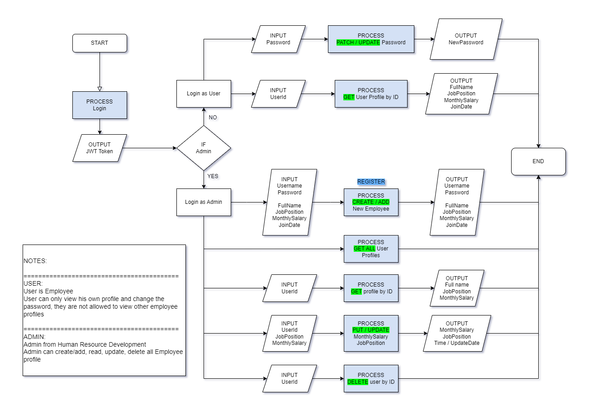
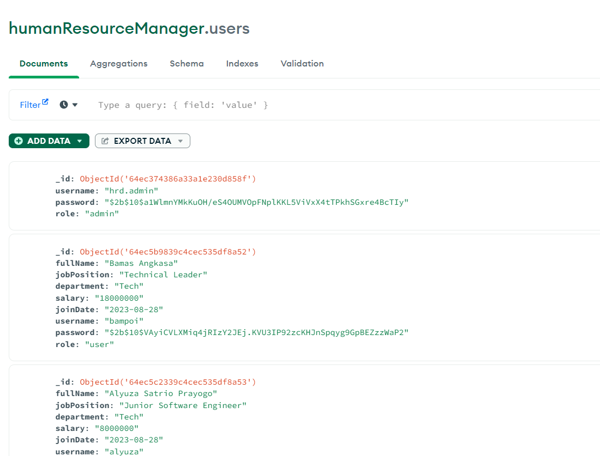
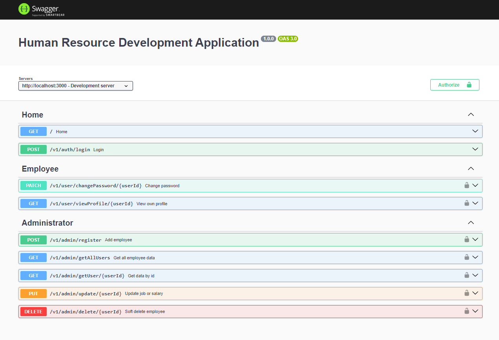

<!-- [](https://classroom.github.com/a/XqBuIcOG) -->
# Project Milestone 2
---
# Human Resource Development Application
An HRD application designed to streamline employee management. This application allows 'Administrators' to register new employee, read all employee data profiles, update their salary / job position, and can soft delete employee profile for enhanced data control.
For Employees 'user', they can log in using their provided username and password, granting them access to their personal profiles only. They can view and modify their profiles, including the ability to update passwords.
With Role-Based Access Control (RBAC), this HR application empowers organizations to manage their workforce effectively, ensuring data security and efficient employee management.

---

## Flowchart



---
## Tools & Ingredients

- Node.js & Express.js
- Swagger UI -> API documentation
- MongoDB Atlas -> Database server
- MongoDB Compass -> Database monitor
- Postman -> API development

---
## Features
### Admin Features
**Add New Employee**

- **Description:** Allows the admin to add a new employee to the system.
- **Steps:**
  1. Log in as an admin.
  2. Navigate to the "Add Employee" section.
  3. Fill in the employee details such as fullname, department, job position, salary, username, password.
  4. Click "Add" to save the employee information.

**List All Employees**

- **Description:** Displays a list of all employees in the system.
- **Steps:**
  1. Log in as an admin.
  2. Navigate to the "Employee List" section.
  3. View the list of all employees with basic details.

**List Employee by ID**

- **Description:** Allows the admin to find and view an employee's details by their unique ID.
- **Steps:**
  1. Log in as an admin.
  2. Navigate to the "Employee List" section.
  3. Enter the employee's ID to retrieve and display their details.

**Update Job Position & Salary**

- **Description:** Enables the admin to update an employee's job position and salary.
- **Steps:**
  1. Log in as an admin.
  2. Navigate to the "Employee List" section.
  3. Find the employee whose details need to be updated.
  4. Edit the job position and/or salary fields.
  5. Click "Save" to update the information.

**Soft Delete Employee**

- **Description:** Allows the admin to mark an employee as inactive without permanently removing them.
- **Steps:**
  1. Log in as an admin.
  2. Navigate to the "Employee List" section.
  3. Locate the employee to be soft-deleted.
  4. Choose the "Soft Delete" option to deactivate the employee.
---
### Employee Features

**Change Password**

- **Description:** Enables an employee to change their login password.
- **Steps:**
  1. Log in as an employee.
  2. Navigate to the "Change Password" section in the profile settings.
  3. Enter the current password and the new password.
  4. Click "Change Password" to save the new password.

**View Own Profile**

- **Description:** Allows an employee to view their own profile information.
- **Steps:**
  1. Log in as an employee.
  2. Access the "Profile" section.
  3. View personal details such as name, contact, job position, and salary.

**Restriction on Viewing Other Profiles**

- **Description:** Prevents employees from viewing profiles of other employees.

---

**Available Account**
```
{
    "username" : "hrd.admin",
    "password" : "admin1234",
    "role" : "admin"
}
```
```
{
  "username": "alyuza",
  "password": "user1234"
  "role": "user"
}
```

---

## MongoDB


---

## Swagger UI


---

## Contact Person
[](https://www.linkedin.com/in/alyuzasp/) [](https://www.youtube.com/@alyuza/about) [](https://www.instagram.com/alyuuza/)
